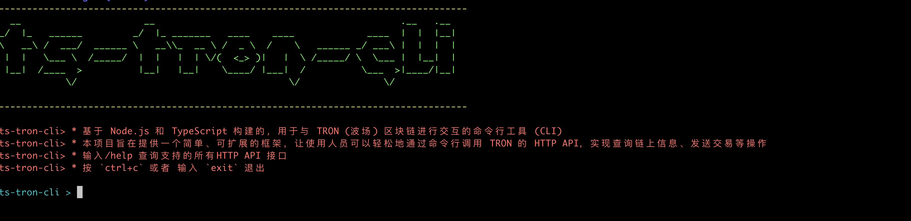
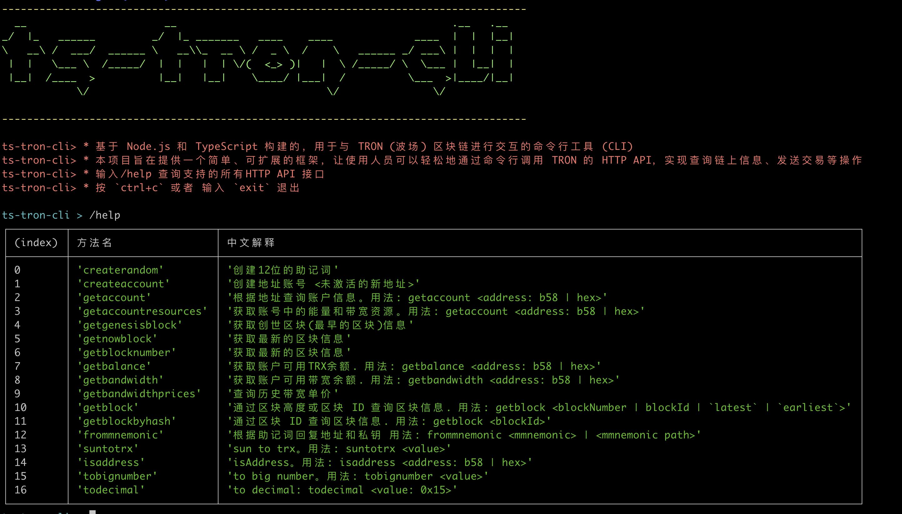

# <center>ts-tron-cli</center>



一个基于 Node.js 和 TypeScript 构建的，用于与 TRON (波场) 区块链进行交互的命令行工具 (CLI)。

本项目旨在提供一个简单、可扩展的框架，让开发者可以轻松地通过命令行调用 TRON 的 HTTP API，实现查询链上信息、发送交易等操作。

## ✨ 功能特性

- **交互式命令行**: 在终端中提供一个持续运行的交互式提示符。
- **清晰的架构**: 命令逻辑、定义和主程序分离，易于理解和维护。
- **易于扩展**: 添加新命令只需修改一个文件，无需改动核心逻辑。
- **TypeScript 支持**: 完整的类型定义，提供更好的开发体验和代码健壮性。
- **美观的输出**: 使用 `chalk` 和 `figlet` 美化输出，使用 `console.table` 格式化帮助信息。

## 🚀 快速开始

## npm packages 

<a href="https://www.npmjs.com/package/ts-tron-cli" target="_blank">npm package ts-tron-cli</a>


## 安装

```shell
npm install -g @mazezen/ts-tron-cli
```


## 设置环境变量

> 可选设置。这三项只有在交易的时候才会用到
>
> TRON_PRO_API_KEY
>
> TRON_DEFAULT_ADDRESS_BASE58
>
> TRON_DEFAULT_ADDRESS_HEX

### Mac && Linux

```shell
export TRON_FULL_HOST="https://api.trongrid.io"
export TRON_PRO_API_KEY=""
export PRIVATE_KEY=""
export TRON_DEFAULT_ADDRESS_BASE58=""
export TRON_DEFAULT_ADDRESS_HEX=""
```

### windows

```shell
set TRON_FULL_HOST="https://api.trongrid.io"
set TRON_PRO_API_KEY=""
set PRIVATE_KEY=""
set TRON_DEFAULT_ADDRESS_BASE58=""
set TRON_DEFAULT_ADDRESS_HEX=""
```


## 📖 使用说明

程序启动后，你可以输入相应的命令并按回车键来执行。

### 可用命令

输入 `/help` 可以查看所有支持的命令及其说明：


| (index) | 方法名                   | 中文解释                                                                                                     | 英文解释                                                                                                                            |
| ------- | ------------------------ | ------------------------------------------------------------------------------------------------------------ | ----------------------------------------------------------------------------------------------------------------------------------- |
| 0       | createrandom             | 创建 12 位的助记词                                                                                           | Create a 12-word mnemonic phrase                                                                                                    |
| 1       | createaccount            | 创建地址账号 <未激活的新地址>                                                                                | Create an address account <unactivated new address>                                                                                 |
| 2       | getaccount               | 根据地址查询账户信息。用法: getaccount <address: b58                                                         | hex>                                                                                                                                |
| 3       | getaccountresources      | 获取账号中的能量和带宽资源。用法: getaccount <address: b58                                                   | hex>                                                                                                                                |
| 4       | getgenesisblock          | 获取创世区块(最早的区块)信息                                                                                 | Get information about the genesis block (earliest block)                                                                            |
| 5       | getnowblock              | 获取最新的区块信息                                                                                           | Get information about the latest block                                                                                              |
| 6       | getblocknumber           | 获取最新的区块信息                                                                                           | Get the latest block number                                                                                                         |
| 7       | getbalance               | 获取账户可用 TRX 余额。用法: getbalance <address: b58                                                        | hex>                                                                                                                                |
| 8       | getbandwidth             | 获取账户可用带宽余额。用法: getbandwidth <address: b58                                                       | hex>                                                                                                                                |
| 9       | getbandwidthprices       | 查询历史带宽单价                                                                                             | Query historical bandwidth unit prices                                                                                              |
| 10      | getblock                 | 通过区块高度或区块 ID 查询区块信息。用法: getblock <blockNumber                                              | blockId                                                                                                                             |
| 11      | getblockbyhash           | 通过区块 ID 查询区块信息。用法: getblock <blockId>                                                           | Query block information by block ID. Usage: getblock <blockId>                                                                      |
| 12      | getblockbynumber         | 通过区块高度查询区块信息。用法: getblockbynumber <blockNumber>                                               | Query block information by block height. Usage: getblockbynumber <blockNumber>                                                      |
| 13      | getblockrange            | 通过区块高度区间查询区块信息。用法: getblockrange <startBlockNumber, endBlockNumber>                         | Query block information by block height range. Usage: getblockrange <startBlockNumber, endBlockNumber>                              |
| 14      | getblocktransactioncount | 检索区块内的交易数量。用法: getBlockTransactionCount <blockHeight                                            | blockHash                                                                                                                           |
| 15      | getbrokerage             | 获取 SR 经纪佣金比例。用法: getbrokerage <address>                                                           | Get the SR brokerage commission ratio. Usage: getbrokerage <address>                                                                |
| 16      | getnodeinfo              | 查询节点信息                                                                                                 | Query node information                                                                                                              |
| 17      | gettokenlistbyname       | 通过代币名称 查询 TRC10 代币列表信息。用法: gettokenlistbyname <tokenName>                                   | Query TRC10 token list information by token name. Usage: gettokenlistbyname <tokenName>                                             |
| 18      | gettokenbyid             | 通过代币 id 查询 TRC10 代币信息。用法: gettokenbyid <tokenID>                                                | Query TRC10 token information by token ID. Usage: gettokenbyid <tokenID>                                                            |
| 19      | gettokenfromid           | 通过代币 id 查询 TRC10 代币信息。用法: gettokenfromid <tokenID>                                              | Query TRC10 token information by token ID. Usage: gettokenfromid <tokenID>                                                          |
| 20      | gettokensissuedbyaddress | 查询账户的 TRC10 代币发行信息。用法: gettokensissuedbyaddress <address: b58                                  | hex>                                                                                                                                |
| 21      | gettransaction           | 通过交易 id 查询交易信息。用法: gettransaction <txId>                                                        | Query transaction information by transaction ID. Usage: gettransaction <txId>                                                       |
| 22      | sendtoken                | 交易 TRC10。用法: sendtoken <to: b58, amount: 1 (对应代币最小单位), tokenID: 代币 ID>                        | Transfer TRC10 tokens. Usage: sendtoken <to: b58, amount: 1 (smallest token unit), tokenID: token ID>                               |
| 23      | sendrawtransaction       | 交易 TRX。用法: sendrawtransaction <to: b58, amount: 1 (单位: TRX)>                                          | Transfer TRX. Usage: sendrawtransaction <to: b58, amount: 1 (unit: TRX)>                                                            |
| 24      | sendtrc20                | 交易 TRC20(注意:此交易会消耗 100TRX)。用法: sendtrc20 <to: b58, amount: 代币数量, contractAddress: 合约地址> | Transfer TRC20 tokens (Note: consumes 100 TRX). Usage: sendtrc20 <to: b58, amount: token amount, contractAddress: contract address> |
| 25      | sign                     | 交易签名(并未广播上链)。用法: sign <from: b58, amount: 1 (单位 TRX), to: b58>                                | Sign a transaction (not broadcasted). Usage: sign <from: b58, amount: 1 (unit TRX), to: b58>                                        |
| 26      | sendhextransaction       | 交易签名(将上一步的 sign 广播上链)。用法: sendhextransaction <signedTransaction>                             | Broadcast a signed transaction. Usage: sendhextransaction <signedTransaction>                                                       |
| 27      | delegatebandwidth        | 代理带宽。用法: delegatebandwidth <to: b58, amount>                                                          | Delegate bandwidth. Usage: delegatebandwidth <to: b58, amount>                                                                      |
| 28      | undelegatebandwidth      | 回收带宽。用法: undelegatebandwidth <from: b58, amount>                                                      | Undelegate bandwidth. Usage: undelegatebandwidth <from: b58, amount>                                                                |
| 29      | delegateenergy           | 代理能量。用法: delegateenergy <to: b58, amount>                                                             | Delegate energy. Usage: delegateenergy <to: b58, amount>                                                                            |
| 30      | undelegateenergy         | 回收带宽。用法: undelegateenergy <from: b58, amount>                                                         | Undelegate energy. Usage: undelegateenergy <from: b58, amount>                                                                      |
| 31      | frommnemonic             | 根据助记词回复地址和私钥 用法: frommnemonic <mmnemonic>                                                      | <mmnemonic path>                                                                                                                    |
| 32      | suntotrx                 | sun to trx。用法: suntotrx <value>                                                                           | Convert sun to TRX. Usage: suntotrx <value>                                                                                         |
| 33      | isaddress                | isAddress。用法: isaddress <address: b58                                                                     | hex>                                                                                                                                |
| 34      | tobignumber              | to big number。用法: tobignumber <value>                                                                     | Convert to big number. Usage: tobignumber <value>                                                                                   |
| 35      | todecimal                | to decimal: todecimal <value: 0x15>                                                                          | Convert to decimal. Usage: todecimal <value: 0x15>                                                                                  |

## 项目还在开发中,命令尚未加完.如果你愿意,很乐意你参与其中加入新的命令

### 开发流程

1.  **创建命令函数**:

    - 在 `src/` 目录下相关的文件中 (例如, 与账户相关的命令在 `src/account.ts` 中), 创建一个新的 `async` 函数。
    - 这个函数会接收一个 `tronWeb` 实例和任意数量的参数。

2.  **注册新命令**:
    - 打开 `src/commands.ts` 文件。
    - 从你创建函数的文件中导入你的函数。
    - 在 `commands` Map 中, 使用 `commands.set()` 添加你的新命令，并提供命令名称、描述和你的函数。

现在你可以重新编译和运行项目, 你的新命令应该出现在 `/help` 列表中了。

## 欢迎提 Issue 和 PR🚀

## 📄 许可证

本项目基于 [MIT](https://github.com/mazezen/ts-tron-cli/blob/main/LICENSE) 许可证。
