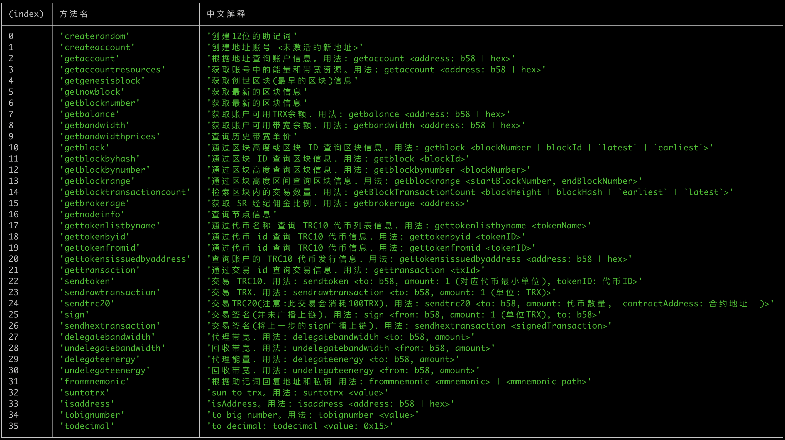

# 
ts-tron-cli

一个基于 Node.js 和 TypeScript 构建的，用于与 TRON (波场) 区块链进行交互的命令行工具 (CLI)。

本项目旨在提供一个简单、可扩展的框架，让开发者可以轻松地通过命令行调用 TRON 的 HTTP API，实现查询链上信息、发送交易等操作。

## ✨ 功能特性

- **交互式命令行**: 在终端中提供一个持续运行的交互式提示符。
- **清晰的架构**: 命令逻辑、定义和主程序分离，易于理解和维护。
- **易于扩展**: 添加新命令只需修改一个文件，无需改动核心逻辑。
- **TypeScript 支持**: 完整的类型定义，提供更好的开发体验和代码健壮性。
- **美观的输出**: 使用 `chalk` 和 `figlet` 美化输出，使用 `console.table` 格式化帮助信息。

## 🚀 快速开始

### 环境要求

- [Node.js](https://nodejs.org/) (建议使用 v16 或更高版本)
- [npm](https://www.npmjs.com/)

## 📖 使用说明

程序启动后，你可以输入相应的命令并按回车键来执行。

### 可用命令

输入 `/help` 可以查看所有支持的命令及其说明：

## 项目还在开发中,命令尚未加完.如果你愿意,很乐意你参与其中加入新的命令

## 📄 许可证

本项目基于 [MIT](https://github.com/mazezen/ts-tron-cli/blob/main/LICENSE) 许可证。
