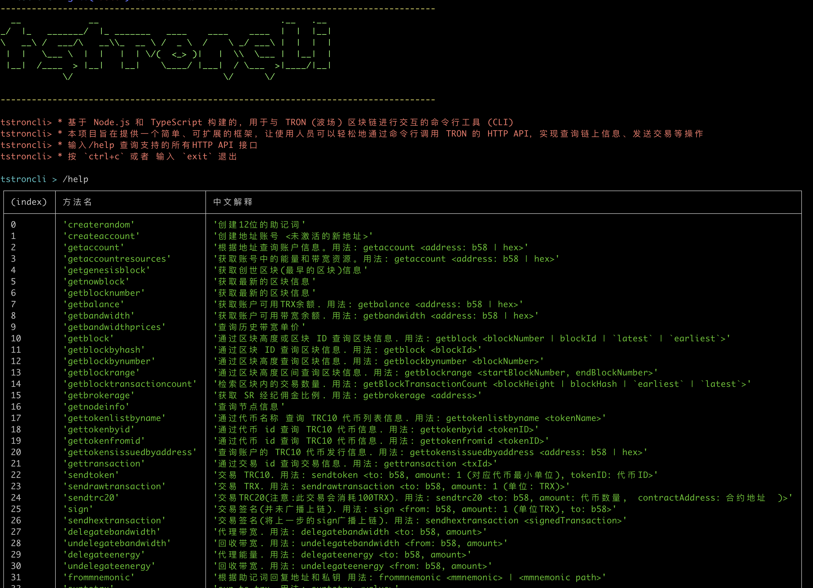

# <center>tstroncli</center>



A command-line interface (CLI) tool built with Node.js and TypeScript for interacting with the TRON blockchain.

This project aims to provide a simple and extensible framework that allows developers to easily call TRON's HTTP API from the command line to perform operations such as querying on-chain information and sending transactions.

## ✨ Features

- **Interactive Command Line**: Provides a persistent interactive prompt in the terminal.
- **Clear Architecture**: Separation of command logic, definitions, and the main program for easy understanding and maintenance.
- **Easy to Extend**: Adding new commands only requires modifying one file without changing the core logic.
- **TypeScript Support**: Complete type definitions for a better development experience and code robustness.
- **Elegant Output**: Uses `chalk` and `figlet` to beautify the output, and `console.table` to format help messages.

## 🚀 Quick Start

### Prerequisites

- <a href="https://nodejs.org" target="_blank">Node: 20.18.0</a>
- <a href="https://www.npmjs.com/" target="_blank">Npm: 10.8.2</a>

### Npm packages

<a href="https://www.npmjs.com/package/tstroncli" target="_blank">npm package tstroncli</a>

### Installation

```shell
npm install -g tstroncli
```

### Launch

```shell
tstroncli
```

### Set Environment Variables

> Optional settings. These three are only used for transactions.
>
> PRIVATE_KEY
>
> TRON_DEFAULT_ADDRESS_BASE58
>
> TRON_DEFAULT_ADDRESS_HEX

#### Mac && Linux

```shell
export TRON_FULL_HOST="https://api.trongrid.io"
export TRON_PRO_API_KEY=""
export PRIVATE_KEY=""
export TRON_DEFAULT_ADDRESS_BASE58=""
export TRON_DEFAULT_ADDRESS_HEX=""
```

#### Windows

```shell
set TRON_FULL_HOST="https://api.trongrid.io"
set TRON_PRO_API_KEY=""
set PRIVATE_KEY=""
set TRON_DEFAULT_ADDRESS_BASE58=""
set TRON_DEFAULT_ADDRESS_HEX=""
```

## 📖 Usage

After starting the `tstroncli` program, you can enter a command and press Enter to execute it.

### Available Commands

Enter `/help` to see all supported commands and their descriptions:


| (index) | Method Name              | Description                                                                                                                 |
| ------- | ------------------------ | --------------------------------------------------------------------------------------------------------------------------- |
| 0       | createrandom             | Create a 12-word mnemonic phrase                                                                                            |
| 1       | createaccount            | Create an address account <unactivated new address>                                                                         |
| 2       | getaccount               | Query account information by address. Usage: getaccount <address: b58 or hex>                                               |
| 3       | getaccountresources      | Get energy and bandwidth resources in the account. Usage: getaccountresources <address: b58 or hex>                           |
| 4       | getgenesisblock          | Get information about the genesis block (earliest block)                                                                    |
| 5       | getnowblock              | Get information about the latest block                                                                                      |
| 6       | getblocknumber           | Get the latest block number                                                                                                 |
| 7       | getbalance               | Get the available TRX balance of an account. Usage: getbalance <address: b58 or hex>                                        |
| 8       | getbandwidth             | Get the available bandwidth of an account. Usage: getbandwidth <address: b58 or hex>                                        |
| 9       | getbandwidthprices       | Query historical bandwidth unit prices                                                                                      |
| 10      | getblock                 | Query block information by block height or block ID. Usage: getblock <blockNumber or blockId>                               |
| 11      | getblockbyhash           | Query block information by block ID. Usage: getblockbyhash <blockId>                                                        |
| 12      | getblockbynumber         | Query block information by block height. Usage: getblockbynumber <blockNumber>                                              |
| 13      | getblockrange            | Query block information by block height range. Usage: getblockrange <startBlockNumber, endBlockNumber>                      |
| 14      | getblocktransactioncount | Retrieve the number of transactions in a block. Usage: getblocktransactioncount <blockHeight or blockHash>                    |
| 15      | getbrokerage             | Get the SR brokerage commission ratio. Usage: getbrokerage <address>                                                        |
| 16      | getnodeinfo              | Query node information                                                                                                      |
| 17      | gettokenlistbyname       | Query TRC10 token list information by token name. Usage: gettokenlistbyname <tokenName>                                     |
| 18      | gettokenbyid             | Query TRC10 token information by token ID. Usage: gettokenbyid <tokenID>                                                    |
| 19      | gettokenfromid           | Query TRC10 token information by token ID. Usage: gettokenfromid <tokenID>                                                  |
| 20      | gettokensissuedbyaddress | Query TRC10 token issuance information for an account. Usage: gettokensissuedbyaddress <address: b58 or hex>                |
| 21      | gettransaction           | Query transaction information by transaction ID. Usage: gettransaction <txId>                                               |
| 22      | sendtoken                | Transfer TRC10 tokens. Usage: sendtoken <to: b58, amount: 1 (smallest token unit), tokenID: token ID>                        |
| 23      | sendrawtransaction       | Transfer TRX. Usage: sendrawtransaction <to: b58, amount: 1 (unit: TRX)>                                                   |
| 24      | sendtrc20                | Transfer TRC20 tokens (Note: consumes 100 TRX). Usage: sendtrc20 <to: b58, amount: token amount, contractAddress: contract address> |
| 25      | sign                     | Sign a transaction (not broadcasted). Usage: sign <from: b58, amount: 1 (unit TRX), to: b58>                                 |
| 26      | sendhextransaction       | Broadcast a signed transaction. Usage: sendhextransaction <signedTransaction>                                               |
| 27      | delegatebandwidth        | Delegate bandwidth. Usage: delegatebandwidth <to: b58, amount>                                                              |
| 28      | undelegatebandwidth      | Undelegate bandwidth. Usage: undelegatebandwidth <from: b58, amount>                                                        |
| 29      | delegateenergy           | Delegate energy. Usage: delegateenergy <to: b58, amount>                                                                    |
| 30      | undelegateenergy         | Undelegate energy. Usage: undelegateenergy <from: b58, amount>                                                              |
| 31      | frommnemonic             | Recover address and private key from mnemonic. Usage: frommnemonic <mnemonic or path>                                       |
| 32      | suntotrx                 | Convert sun to TRX. Usage: suntotrx <value>                                                                                 |
| 33      | isaddress                | Check if an address is valid. Usage: isaddress <address: b58 or hex>                                                        |
| 34      | tobignumber              | Convert to big number. Usage: tobignumber <value>                                                                           |
| 35      | todecimal                | Convert to decimal. Usage: todecimal <value: 0x15>                                                                          |

## The project is still under development, and more commands are yet to be added. Contributions are welcome!

### Development Process

1.  **Create a command function**:

    - In the relevant file under the `src/` directory (e.g., account-related commands are in `src/account.ts`), create a new `async` function.
    - This function will receive a `tronWeb` instance and any number of arguments.

2.  **Register the new command**:
    - Open the `src/commands.ts` file.
    - Import your function from the file where you created it.
    - In the `commands` Map, use `commands.set()` to add your new command, providing the command name, description, and your function.

Now you can recompile and run the project, and your new command should appear in the `/help` list.

## Issues and PRs are welcome 🚀

## 📄 License

This project is licensed under the [MIT](https://github.com/mazezen/troncli/blob/master/LICENSE) License.
